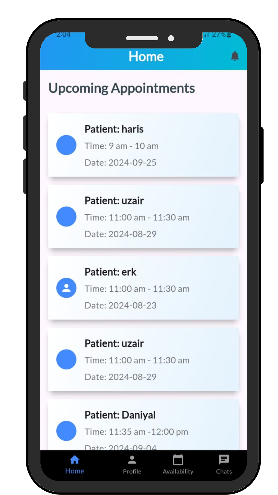
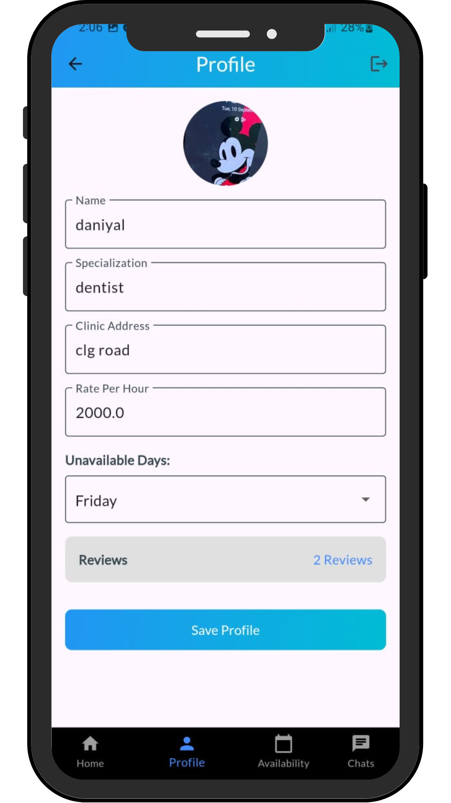
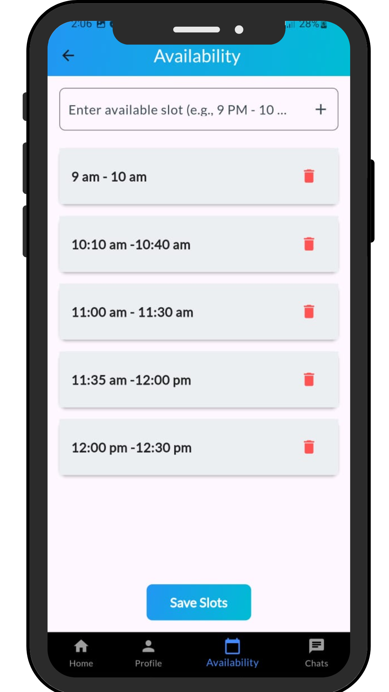
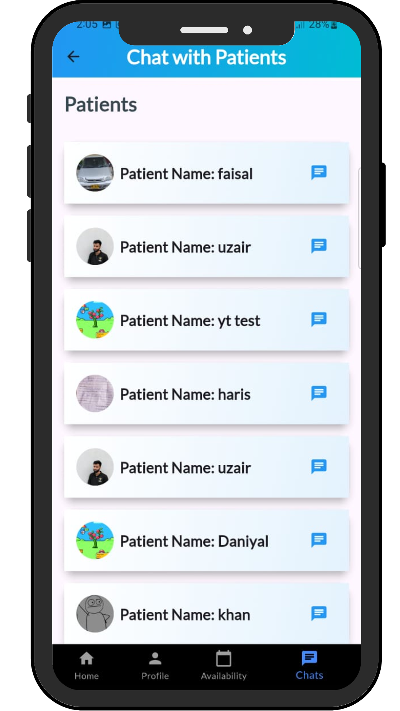
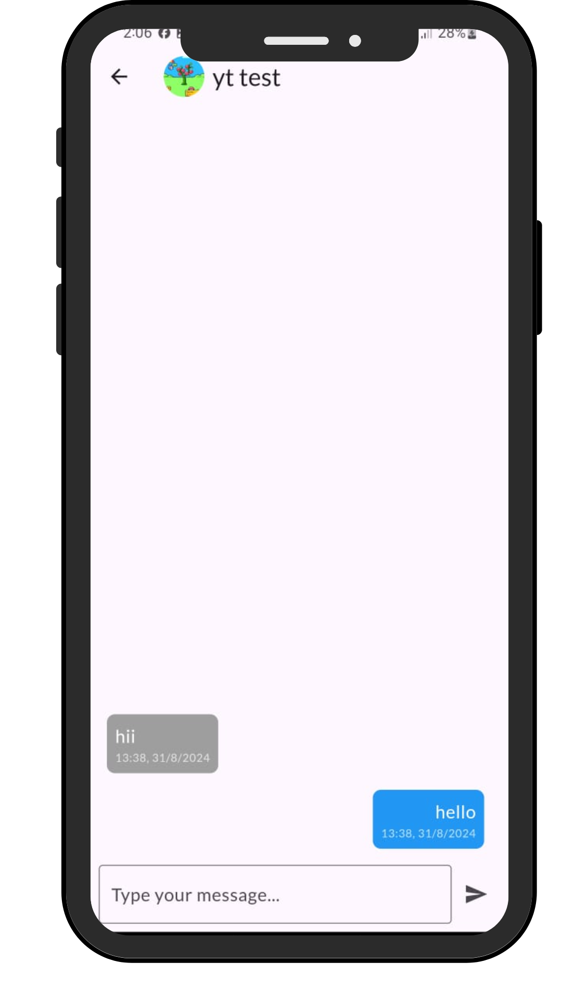

# Doctor-Patient Appointment App

This **Doctor-Patient Appointment App** was developed as part of my internship experience, where I collaborated with another intern to build a user-friendly appointment booking system. The app allows doctors to manage appointments and communicate with patients, while patients can book appointments, chat with doctors, and make payments through the app.

## 📱 App Overview

The Doctor-Patient Appointment App streamlines the process of booking and managing appointments, providing real-time notifications, secure chats, and payment integration. The app was built using **Flutter** and integrated with **Firebase** for real-time database management and cloud functions.

## 🎯 Key Features

### 1. Doctor Features:
- **Profile Management**: Doctors can set up their profiles, including their availability, fees, and specialization.
- **Appointment Management**: Doctors can view, accept, or reject appointments from patients.
- **Push Notifications**: Doctors receive real-time notifications when patients book appointments.
- **Chat with Patients**: A chat feature where doctors can communicate directly with patients.
- **Payment Integration**: Doctors can receive payments from patients via integrated payment methods (EasyPaisa, JazzCash).

### 2. Patient Features:
- **Appointment Booking**: Patients can search for doctors, view their availability, and book appointments.
- **View Doctor Profiles**: Patients can view doctor profiles, including reviews and ratings.
- **Real-Time Notifications**: Patients are notified when their appointment is confirmed, canceled, or when a message is received from the doctor.
- **Chat with Doctors**: Secure chat feature to discuss health concerns with doctors.
- **Payments**: Patients can make payments directly through the app for confirmed appointments.

## 🔑 Tech Stack

- **Frontend**: Flutter (Dart)
- **Backend**: Firebase (Firestore, Authentication, Cloud Functions)
- **Push Notifications**: Firebase Cloud Messaging (FCM)
- **Payment Integration**: JazzCash, EasyPaisa (sandbox)
- **Real-Time Database**: Firestore
- **Storage**: Firebase Storage (for patient and doctor profile images)

## 📸 UI Screens

1. **Doctor Home Screen**

   

   
Doctor Home Screen

2. **Doctor Profile Screen**

   

   
Doctor Profile Screen

3. **Doctor Availability Screen**

   

   
Doctor Availability Screen

4. **Doctor Chat List Screen**

   

   
Doctor Chat List Screen

5. **Chat Screen**

   
   
Chat Screen

 
